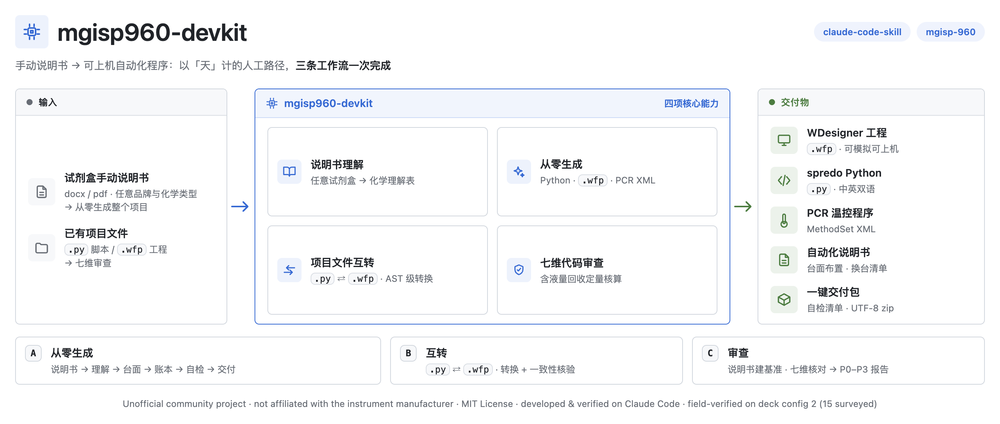

<div align="center">

**"Meet other creators. Master a new skill."**

[🇺🇸 English](README_EN.md) | 🇨🇳 简体中文

# mgisp960-devkit

**让 Claude 读懂建库试剂盒说明书，为 MGISP-960 撰写自动化程序**

*Teach Claude to read library-prep protocols — and to program the MGISP-960.*




</div>

---

## 它能做什么

手动说明书 → 可上机的自动化程序，人工走完通常要好几天。这个 skill 把它拆成三条工作流，由 Claude 跑完：

| # | 功能 | 输入 | 输出 |
|---|------|------|------|
| 1 | **说明书理解** | 任意建库试剂盒手动说明书（docx/pdf） | 化学理解表：试剂分类 + 操作序列 + 存疑清单 |
| 2 | **从零生成** | 用户确认后的理解表 | spredo Python 脚本（中英双语）+ WDesigner `.wfp` 工程 + PCR 温控 XML + 自动化说明书 + 交付包 |
| 3 | **项目文件互转** | 已有 `.py` 或 `.wfp` | 另一种形态 + 一致性核验（py→wfp 为 AST 级自动转换） |
| 4 | **代码审查** | 中文说明书 + 已有代码/工程 | 七维分级报告（P0–P3），含液体处理质量与回收定量核算 |

第 4 项是这个 skill 真正与众不同的地方：不只对照语法，每一步液体处理都做定量核算——

> 吸得足吗？吸得净吗（残留折算到 μL）？乙醇洗涤吸干净了吗？洗脱产物还能多吸多少？
>
> 每个问题都附数字估算。

## 效果预览

**Claude Code 里的交互式需求确认**——全程选项式提问，需求没确认前不动手：


**从说明书/spredo 直接生成 WDesigner 工程**——生成的 `.wfp` 在 WDesigner 中直接打开、可模拟可上机：

| | |
|---|---|
|  |  |

**交付物**（每个项目自动生成）：

| WDesigner 工程文件 | spredo Python 脚本（中英双语） |
|---|---|
|  |  |

<p align="center"><br><sub>自动化说明书（台面布置 / 换台清单 / 温控程序表 / 质控常见问题）</sub></p>

## 实战案例

一份从官网随手下载的建库试剂盒说明书 PDF，到能在 WDesigner 打开、可模拟可上机的
完整工程交付包——全过程实录：模型与 Agent 选型、8 组需求确认、说明书到工程的全流程、WDesigner 实机打开截图：

**→ [实战案例：Ultra II DNA 建库说明书 → 完整 WDesigner 工程](docs/实战案例_UltraII-DNA建库.md)**

## 推荐运行环境

**模型：多模态 + 长上下文**（2026-09 检索）——说明书里的流程图与加样表要靠视觉通道读，
液量账本逐条明细吃上下文长度，两者缺一不可：

| 推荐 | 模型 | 上下文 |
|---|---|---|
| 本案例实测 | GLM-5.3-Flash | 百万级 |
| 国产多模态 | Kimi K3、Qwen3.8 Max、DeepSeek V4 | 1M 级 |
| 国际备选 | Gemini 3.5 Flash、GPT-5.6 Sol、Claude Opus 4.8 | 1M 级 |

**Agent：支持 Agent Skills 标准（SKILL.md）的编码 Agent**：

- **Claude Code**——原生支持，本案例实测
- **Codex**——原生支持 Agent Skills
- **Gemini CLI**——官方支持开放格式
- **OpenCode / Cline / Roo / Kilo**——开源系，直接读 SKILL.md
- **WorkBuddy**

> 选型理由与实测记录见 [实战案例](docs/实战案例_UltraII-DNA建库.md) 的
> "开始之前：模型与 Agent 怎么选"。

## 怎么用

## 怎么用

### 安装

```bash
git clone https://github.com/WarteToni/mgisp960-devkit.git ~/.claude/skills/mgisp960-devkit
```

### 唤醒

在 Claude Code 对话里提到这些，skill 即被触发：

- 「960 脚本」「移液程序」「spredo」「WDesigner」「wfp 工程」
- 「把这份试剂盒说明书搬到 960 上」
- 「审一下这个脚本 / 这个工程」
- 「回收率/残留核算」「960 脚本报错调试」

### 三条工作流

| 工作流 | 场景 | 流程 |
|--------|------|------|
| **A · 从零生成** | 给一份手动说明书，要 Python 脚本 / WD 工程 / 两者 | S0 需求确认 → 说明书理解 → 台面设计 → 液量账本 → 参数回填 → 四层自检 → 交付包 |
| **B · 互转** | 已有 `.py` 或 `.wfp`，转成另一种形态 | AST 级自动转换（py→wfp）或官方导出（wfp→py）+ 逐行一致性核验 |
| **C · 审查** | 说明书 + 已有代码/工程，查问题 | 说明书建基准 → 统一操作序列 → 液量账本当审查器 → 七维核对 → P0–P3 分级报告 |

唤醒后它先问一句：「你现在需要我做什么？」

### 直接生成 WFP 文件

想手动把一份 spredo 脚本转成 `.wfp` 工程（或想了解它的生成原理）：
模板从哪来、命令怎么写、产物怎么验，见 **[docs/生成WFP文件操作指南.md](docs/生成WFP文件操作指南.md)**——
仓库自带零依赖的合成模板，clone 即用，无需任何原厂文件。

## 目录结构

```
mgisp960-devkit/
├── SKILL.md            # 入口：三条工作流、必问清单、红线速记
├── docs/               # 面向使用者的操作指南（生成 WFP 文件等）
├── references/         # 14 篇参考文档，按 6 层职责组织
│   ├── 00–01           # 说明书解读法；硬件/台面规则
│   ├── 02–04, 09       # spredo 语法 / WD 语法 / PCR XML / .wfp 格式
│   ├── 05, 11, 13      # 液体参数三层体系：经验区间 → 实测数据 → 模块规律
│   ├── 07–08, 10       # 四层自检；踩坑库；七维审查方法论
│   └── 06, 12          # 自动化说明书生成；耗材最省优化
└── scripts/            # spredo→wfp AST 生成器、直写账本审计器、全面自检、
                        # 双语版/说明书生成模板、wfp 液量账本模板
```

## 设计理念

- **化学来自说明书，手艺来自这个仓库。** 硬件规则、语法、格式是通用的；试剂盒化学每次从输入的说明书现场理解，不绑定任何试剂盒、公司或化学类型
- **参数分三层：规则 > 数据 > 经验。** 模块规律定结构，液面曲线和分档数据定数值，经验区间只做兜底，上层覆盖下层
- **先跑液量账本，再写参数。** 每一步 Z 高和速率都从全流程逐孔液面模拟导出，不凭单步直觉定参
- **交付前过四道门。** 编译 → 全面自检（板流/容量/枪头量程/弹窗互证等 11 类）→ 软件模拟 → 上机；自检不过，不准交付
- **交付物不带品牌。** 说明书和代码里不出现任何公司名与 logo；项目名由你定

## 能力边界

- ✅ **能**：说明书理解，脚本/工程/XML/说明书生成，py↔wfp 互转，七维审查
- ✅ **运行环境**：本 skill 的交互流程与验证都在 Claude Code 上完成；知识文档与脚本模板本身是通用的
- ⚠️ **其他 Agent / 运行时未经验证**：在 Claude Code 之外（其他 CLI Agent、API 直调、IDE 插件等）加载本仓库，行为与效果不做保证，风险自负
- ❌ **不能**：替你跑实机水跑，或保证首次软件模拟零报错。但内置了调试方法论和报错根因库，出了问题知道去哪查

## 声明

本项目为**非官方**社区项目，与设备制造商及其关联方无任何隶属、授权或背书关系；
项目中提及的产品名称与型号仅用于描述兼容性。使用本项目生成的程序操作设备前，
请自行验证并遵守设备与试剂的官方使用规范。

## License

[MIT](LICENSE) — 自由使用、修改与分发，保留版权声明即可。
