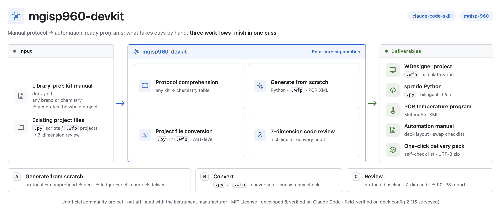
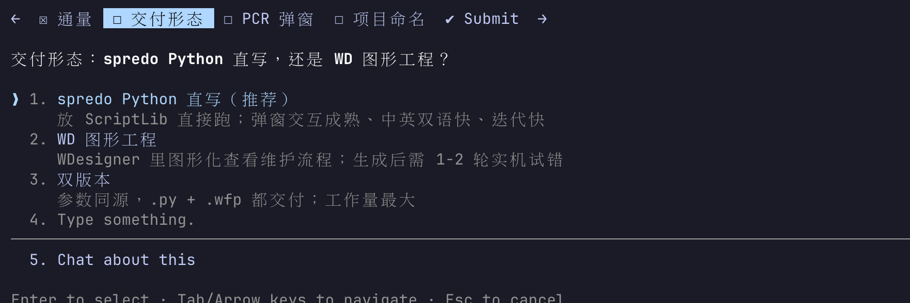
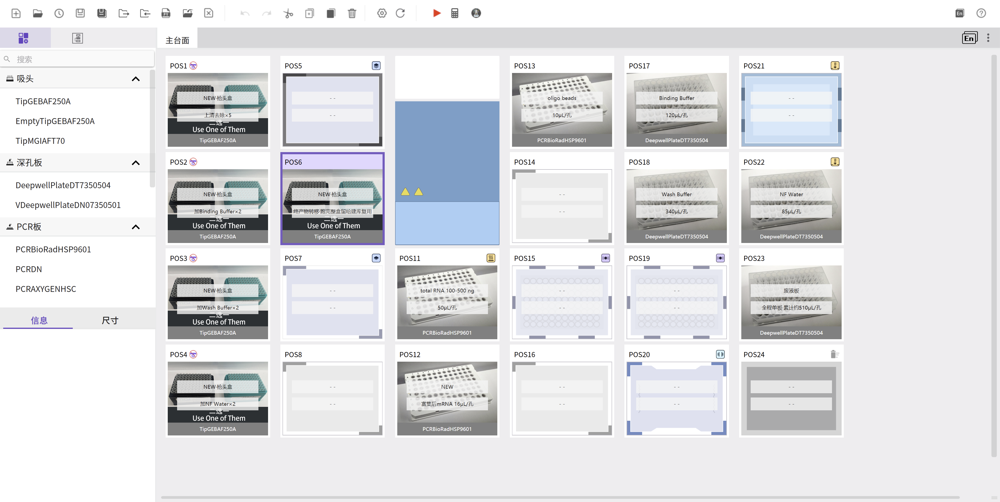
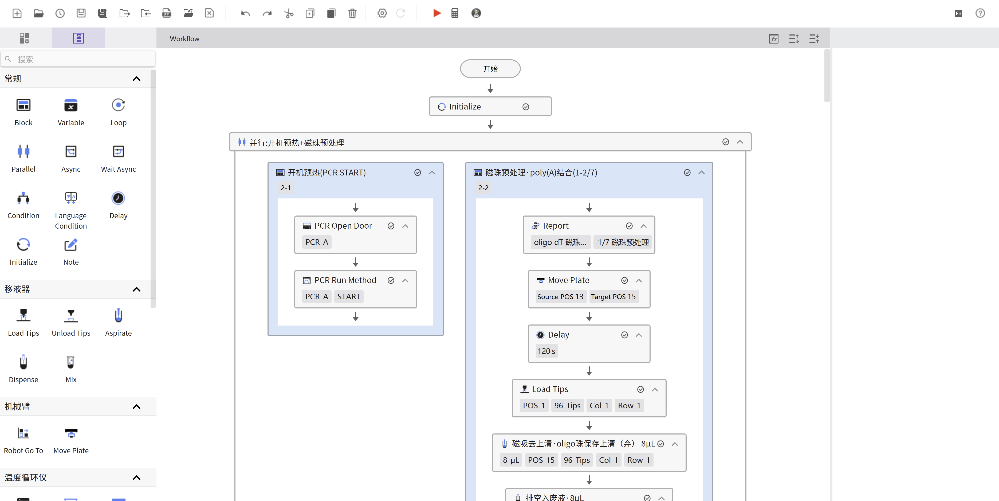
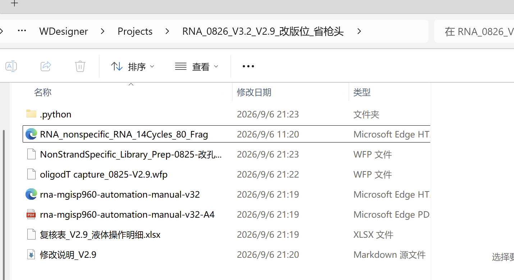
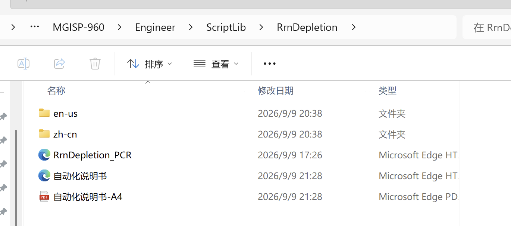
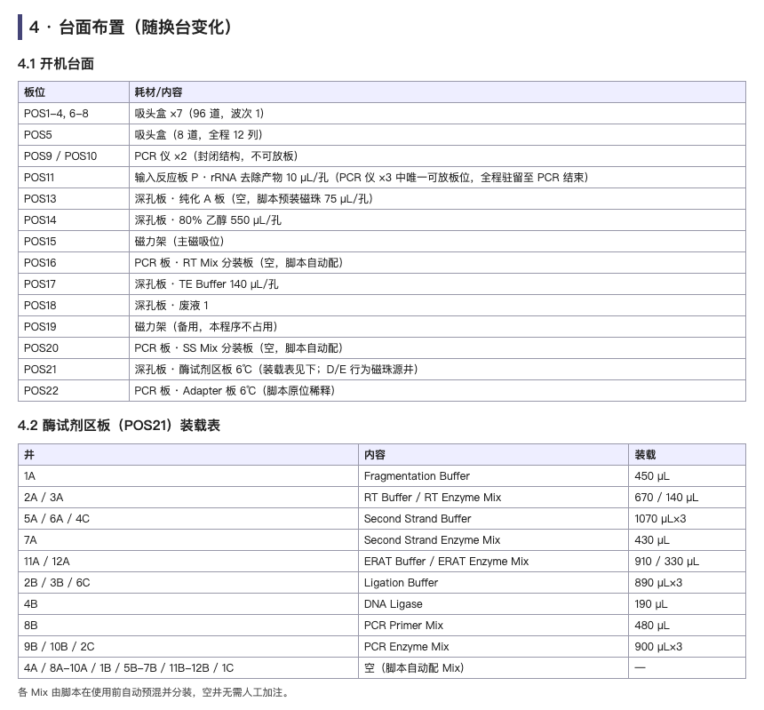

<div align="center">

**"Meet other creators. Master a new skill."**

[🇺🇸 English](README_EN.md) | 🇨🇳 [简体中文](README.md)

# mgisp960-devkit

**Teach Claude to read library-prep protocols — and to program the MGISP-960**

*让 Claude 读懂建库试剂盒说明书，为 MGISP-960 撰写自动化程序*




</div>

---

## What it does

Turning a written protocol into a runnable automation program takes days by hand. This skill breaks it into three Claude-driven workflows:

| # | Feature | Input | Output |
|---|---------|-------|--------|
| 1 | **Protocol understanding** | Any library-prep kit manual (docx/pdf) | A chemistry digest: reagent classification + operation sequence + open questions |
| 2 | **Generate from scratch** | The digest, confirmed by the user | spredo Python scripts (bilingual) + WDesigner `.wfp` project + PCR thermal XML + automation manual + delivery package |
| 3 | **Project file conversion** | An existing `.py` or `.wfp` | The other form + consistency verification (py→wfp is an AST-level automatic conversion) |
| 4 | **Code review** | A Chinese manual + existing code/project | A 7-dimension graded report (P0–P3), with quantitative liquid-handling & recovery accounting |

Item 4 is what sets this skill apart: beyond syntax checking, every liquid-handling step gets a quantitative audit—

> Did it aspirate enough? Did it leave residue (in µL)? Was the ethanol wash fully removed? How much more eluate could be recovered?
>
> Every question comes with a number.

## Preview

**Interactive requirement confirmation in Claude Code** — every decision is an option-style question; nothing starts until requirements are confirmed:



**WDesigner projects generated directly from the manual/spredo script** — the produced `.wfp` opens in WDesigner, simulatable and machine-ready:

| | |
|---|---|
|  |  |

**Deliverables** (generated per project):

| WDesigner project file | spredo Python scripts (bilingual) |
|---|---|
|  |  |

<p align="center"><br><sub>Automation manual (deck layout / swap checklists / thermal methods / QC & FAQ)</sub></p>

## Worked Example

A library-prep manual PDF downloaded from a vendor website, turned into a complete
WDesigner project package — full walkthrough with screenshots, the 8-group requirement
interview, and a liquid-ledger catch of an 8x dosing error:

**→ [Worked example: a library-prep manual → a complete WDesigner project](docs/worked-example-ultra2-dna-en.md)** — model & agent picks, the full 8-group interview, deck & liquid-ledger design, and the project opened in WDesigner on site:

## Recommended Setup

**Model: multimodal + long context** — workflow diagrams and loading tables in a
manual must be read visually, and the per-step liquid-ledger details need a long
context. You want both:


**Agent: any coding agent that supports skill / custom-command extensions**:


> Why these picks: see the opening of the
> [worked example](docs/worked-example-ultra2-dna-en.md) ("Choosing a Model and
> an Agent").

## How to use

### Install

```bash
git clone https://github.com/WarteToni/mgisp960-devkit.git ~/.claude/skills/mgisp960-devkit
```

### Invocation

Mention any of these in Claude Code and the skill wakes up:

- "960 script", "liquid-handling program", "spredo", "WDesigner", "wfp project"
- "port this kit manual onto the 960"
- "review this script / this project"
- "recovery / residue accounting", "960 script error debugging"

### Three workflows

| Workflow | Scenario | Pipeline |
|----------|----------|----------|
| **A · Generate** | Given a manual; want a Python script / WD project / both | S0 requirements → protocol digest → deck design → volume ledger → parameter backfill → 4-layer self-check → delivery package |
| **B · Convert** | Have a `.py` or `.wfp`; want the other form | AST-level conversion (py→wfp) or official export (wfp→py) + line-by-line consistency verification |
| **C · Review** | Manual + existing code/project; find problems | Build baseline from the manual → unified operation sequence → volume ledger as reviewer → 7-dimension check → P0–P3 report |

It opens with one question: "What do you need me to do right now?"

### Generating a .wfp file directly

To convert a spredo script into a `.wfp` project yourself — or to understand how the
format works — see **[docs/生成WFP文件操作指南.md](docs/生成WFP文件操作指南.md)**
(Chinese, with command-line examples). The repo ships a dependency-free synthetic
template, so it works out of the clone with no vendor files required.

## Repository layout

```
mgisp960-devkit/
├── SKILL.md            # Entry: three workflows, must-ask checklist, red lines
├── docs/               # user-facing how-to guides (generating .wfp files, etc.)
├── references/         # 14 reference docs, organized in 6 layers
│   ├── 00–01           # protocol reading; hardware/deck rules
│   ├── 02–04, 09       # spredo syntax / WD syntax / PCR XML / .wfp format
│   ├── 05, 11, 13      # liquid-parameter hierarchy: heuristics → measured data → module rules
│   ├── 07–08, 10       # 4-layer self-check; pitfall log; 7-dimension review methodology
│   └── 06, 12          # automation-manual generation; consumable optimization
└── scripts/            # spredo→wfp AST generator, direct-write ledger auditor,
                        # full self-check, bilingual/manual generation templates, wfp ledger template
```

## Design principles

- **Chemistry comes from the manual; craft comes from this repo.** Hardware rules, syntax, and formats are universal; kit chemistry is read on the spot from each input manual — no binding to any kit, company, or chemistry type
- **Parameters have three layers: rules > data > experience.** Module rules define structure, level curves and tiered data define values, heuristic ranges are the fallback; upper layers override lower ones
- **Run the volume ledger before writing parameters.** Every Z-height and rate is derived from a full-process per-well level simulation, never from single-step intuition
- **Four gates before delivery.** Compile → full self-check (deck flow / capacity / tip range / dialog cross-check, 11 categories) → software simulation → instrument run; fail the self-check, no delivery
- **No brands in deliverables.** Manuals and code carry no company names or logos; project names are up to you

## Limits

- ✅ **Can**: protocol understanding, script/project/XML/manual generation, py↔wfp conversion, 7-dimension review
- ✅ **Runtime**: the skill's interaction flow and verification all run on Claude Code; the knowledge docs and script templates themselves are runtime-agnostic
- ⚠️ **Not verified elsewhere**: loading this repo outside Claude Code (other CLI agents, direct API calls, IDE plugins) carries no guarantee — use at your own risk
- ❌ **Cannot**: run the wet-lab validation for you, or guarantee a zero-error first simulation. But a debugging methodology and root-cause library are built in, so you know where to look

## Disclaimer

This is an **unofficial** community project with no affiliation, authorization, or
endorsement from the instrument manufacturer or its affiliates; product names and
model numbers are mentioned for compatibility description only. Before running any
program generated with this project on an instrument, verify it yourself and follow
the official operating guidelines of the instrument and reagents.

## License

[MIT](LICENSE) — use, modify, and distribute freely; just keep the copyright notice.
