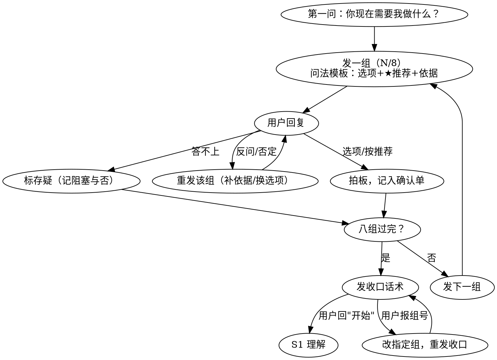

# MGISP-960 自动化程序开发工具包（mgisp960-devkit）

**定位：围绕说明书的四大核心功能——读懂它、从零把它变成代码、让两种项目文件形态
自由互转、拿说明书和液面数据反过来审查已有代码。**
本 skill 只提供机器级知识（硬件规则/语法/格式/参数基准/验证体系），**化学细节
全部来自输入的说明书**——不绑定任何特定试剂盒、公司或化学类型，新项目即插即用。

**运行环境边界（2026-09-09 定）**：本 skill 的交互流程（AskUserQuestion 选项式确认、
Skill 触发机制、S0 门禁）全部在 Claude Code 环境开发与验证；**其他 Agent/运行时未经任何
验证**——知识文档与模板可复用，但流程铁律的执行不保证。

硬件基线：**SP-960 配置 2** + 控制软件（WDesigner 系，spredo 运行时）；全系 15 种配置概览见 `references/01` §〇（其余配置未实机验证）。
首例已验证：RNA 一步法（oligodT 捕获+建库，单换台，模拟全流程通过，2026-08-29）。

## 调用约定（最高优先级，适用于任何调用方式）

**无论本 skill 以何种方式被调用（关键词触发 / 直接提及 / 给了文件就开工），
第一句必须先问用户："你现在需要我做什么？"**——不要自行假设任务直接动手。

**用户给出材料后，先过 S0 需求确认单（见"必问清单"节），再确认走哪条工作流**：

| 引导问题 | 选项 |
|---|---|
| 这次走哪条工作流？ | **A 从零生成**（给说明书，要 Python 脚本 / WD 工程 / 两者）/ **B 互转**（已有 .py 或 .wfp，转成另一种）/ **C 审查**（说明书+已有代码或 .wfp，查问题） |
| 项目名怎么定？ | **反问用户拍板**（见必问清单 #2），不自拟、不带任何公司/品牌名 |
| 要不要生成自动化说明书？ | 要 → 继续问设计文稿与母版（必问 #3/#4）；不要 → 跳过 |

拿不准版本（Python 直写 vs WD）时用下方"版本选择决策表"，仍拿不准就直接问。

<HARD-GATE>
S0 需求确认单（通用项）拍板前：不写任何代码、不改任何文件、不读说明书建理解表
（那属 S1，同样在门禁之后）。"拿到材料就开工"是违规动作。
每阶段应问项问完才进该阶段；中途冒出的取舍当场问，不先做后补问。
（用户 2026-09-09 定）
</HARD-GATE>

## 主流水线（工作流 A 的骨架；先看这张图，再进对应阶段）

```
S0 定向 → S1 理解 → S2 台面 → S3 账本 → S4 成文 → S5 验证 → S6 交付
```

**导航纪律（AI 读法，与调用约定同级）**：

1. **每阶段只读该行列出的文档（≤3 篇）**；门禁未过不进下一阶段。
   禁止一次全读 14 篇——`references/INDEX.md` 是字典（按需查条目），不是教材（不通读）。
2. 具体规则冲突时裁决顺序：**本流水线表 > INDEX 裁决表 > 具体文档**。
3. 三条工作流对流水线的用法：**A 走全段 S0-S6**；**B 互转走 S0→S4（形态侧）→S5**；
   **C 审查走 S0→S1→S3（账本当审查器）→出报告**（见下方工作流 C 节）。

| 阶段 | 干什么 | 只读 | 工具 | 门禁（不过不进下一段） |
|---|---|---|---|---|
| **S0 定向** | 第一问 + 需求确认单 + 选工作流 + 版本决策表 | 仅本文 | — | **需求确认单通用项全部拍板**（工作流、项目名含在内）——未拍板不开工 |
| **S1 理解** | 说明书 → 化学理解表（试剂分类+操作序列+存疑清单）；捕捉多档循环数（必问 #6）与离心类无法直译处 | `00` | — | **用户确认理解表**——此前不写任何代码、不画台面 |
| **S2 台面** | 24 板位 + 换台最小化 + 废液分流 + 装量计算 + 耗材最省 | `01` → `12`（装量规则 `13` §六） | — | 板位图 + **装载定义**成文（=S3 账本输入） |
| **S3 账本**（液面先行） | 按理解表写**操作骨架**（吸/打/混匀的体积与板位，Z 留空）→ 跑账本得每步液面 + 液体身份 | `13` §十 | `账本_全流程液量模拟_模板`（交付 .wfp）/ `spredo直写账本审计_模板`（交付 .py，mock 直审） | 账本跑通、五项审计绿、Z 锚审计过、dump 留档 |
| **S4 成文** | 参数回填：Z/公式/速率**逐个从账本液面导出**；按形态成文 | 参数：`13`→`11`→（兜底`05`）；形态：`02` spredo / `09`+schema wfp / `04` XML | `spredo转wfp_生成器` | 每个 Z 可溯源到账本；编译过 |
| **S5 验证** | 四层自检 + 软件模拟 | `07` | `自检_全面_模板` | 退出码 0（=1 禁止交付）；模拟过 |
| **S6 交付** | 自动化说明书 + 双语 + 打包 | `06`（三问必问 #3/#4） | `英文版/说明书模板` + zipfile | 去标签化断言过 |

**S3 直审形态（2026-09-09 增补）**：spredo 直写交付项目用 `spredo直写账本审计_模板`——
mock spredo 直接 exec 脚本骨架（液体操作进引擎，PCR/弹窗/换台进状态机），零漂移免 wfp；
审计含 Z 锚（吸前液面−Z≥0.5mm，分装尾段线性公式常需改每列 Z 表）、8 头总量口径
（源井消耗=8×每通道体积，语义歧义见 02）。
**S3 液面先行细则（2026-09-06 定）**：动态液面不是"写完再审"，**写参数之前就要有账本**。
骨架 → 账本 → 回填的落地路线：WD 路线先拼 wfp 骨架（Z 占位）→ 跑账本 → 直改回填
（`09` §七）；spredo 路线先写 py 骨架 → 生成器转 wfp → 跑账本 → 回填 py。
**禁止凭单步直觉定 Z**——每个 Z/公式/排空液面锚/混匀双约束都取自账本。

**阶段细则速记**（表格放不下的操作细节）：

- S1：读法先定通道（`00` §〇 双通道纪律：数字走文本抽取、流程图/结构走视觉读；
  开读前先问版本以哪版为准）
- S4 形态：wfp 两条生成路径——A 按活动 schema 拼装 JSON；B 先写 spredo 再用生成器转换
  （已实战 444 节点）。生成后必须 WDesigner 实机验证；改已有 wfp 走程序化直改（`09` §七，
  先往返字节一致验证）。PCR XML 多档循环数且用户拍板做弹窗（必问 #6）时克隆方法簇+require2
- S5：模拟报错要 **Script.log**（别信截图）；行号换算 `脚本行号 = Script.log 行号 − 139`
- S3 账本五项审计：排空贴液面带宽 / 吸液没入深度 / 混匀双约束 / 反应体系终态 vs 说明书 /
  试剂装载五问（方法论 `13` §十）

---

## 工作流 B · 项目文件互相转换（功能 3，不走全流水线）

| 方向 | 方法 |
|---|---|
| **Python → WD** | `scripts/spredo转wfp_生成器.py <脚本.py> <模板.wfp> <输出.wfp> [工程名] [固定PCR方法名]`——AST 自动转换，已实战（444 节点工程）；限制见脚本头部注释（需单换台结构、require2 不转换） |
| **WD → Python** | 首选 **WDesigner 原生导出**（工程→导出 .python/ 目录，官方同源）；或按 `references/09` 解析 .wfp 活动 JSON，用 `references/02` §六对照表反向映射成 spredo 语法 |
| **一致性核验** | **项目目录同含 .wfp 与 .python → 一律读 .wfp**（工程源头、保存即最新；.python 是机器里导出更新的产物，天然滞后——09 §〇）；wfp 活动树拍平（DFS）与 py 执行顺序逐行对位（09 §六）；对齐含结构层（循环壳增删），收尾逐操作终核（踩坑 #15） |

---

## 工作流 C · 审查已有代码/工程（功能 4，流水线三段：S0→S1→账本→报告）

- **输入**：一份中文手动说明书 + 一段代码（spredo .py / WD 导出 .py）或一个原始 .wfp。
- **流程**（完整方法论 `references/10`）：
  1. 到场三问：审查范围（默认全七维）/ 有无基线版本 / .wfp 是否伴随同源 .py
  2. 说明书 → 基准事实表（按 `references/00`，即流水线 S1 同法）
  3. 代码 → 统一操作序列（py 走 AST 源码序；.wfp 按 09 解析映射；踩坑 #13）
  4. **跑账本当审查器**（S3 同工具；交付 .py 用 `spredo直写账本审计_模板`）：`账本_全流程液量模拟_模板` 装载定义按现场真实
     台面重建，五项审计机械化核算（方法论 `13` §十）
  5. **七维核对**：A 化学一致性 / B 硬件符合性 / C 语法 API / D 参数基准 /
     E 文本一致性（弹窗三栏互证）/ F wfp 专项 / **G 液体处理质量与回收**
  6. 输出分级报告：P0 实机必炸 → P1 化学错误/定量回收损失 → P2 带险差异 →
     P3 优化建议；每条含定位+说明书出处+依据+修复建议；存疑项让用户拍板
- **G 维重点**（基准 = `references/11` 液面曲线+分档参数 + `references/13` 模块规律；
  批量核算用账本模板）：吸得足？吸得净（残留折算 μL）？**乙醇洗涤能否尽量吸干净？
  终洗脱能否多吸产物（最大可吸量 = 洗脱体积 − Z 下限以下液体 − 余量）？**速率/气垫
  是否匹配？磁珠预混匀是否降档？——G 维问题必须给定量估算，不空谈
- **默认只审不改**；用户要求修时逐条修，修完按 `references/07` 四层自检复验；
  **改 .wfp 本身走程序化直改**（先往返字节级一致验证，`references/09` §七）。

---

## 通用规则

### 必问清单与提问纪律（引导用户拍板，不要猜）

**提问纪律（用户 2026-09-06 定，2026-09-09 补节奏）**：使用本 skill 全程**默认多问、不猜**——凡有取舍、
偏好、化学风险处，先问用户拍板再动手。问法必须是**"给选项 + 推荐 + 依据"**
（引用 skill 里的经验分档），让确认过程即理清思路；纯机械推导（账本插值、公式
计算、字节级验证）不问。经验库有分档/多解的地方（11 场景表、13 规律表），
不确定用户偏好时问，**不要替用户选**。

**节奏纪律——一组一发（用户 2026-09-09 定，Superpowers 式）**：确认类问题
（S0 八组与各阶段应问项）**一条消息只发一组**，等用户拍板该组后再发下一组；
禁止八组连发表单轰炸，也禁止拆成逐条小问刷屏。行动门禁见调用约定节的
`<HARD-GATE>`。

### S0 需求确认单（任何工作流开工前过一遍；未拍板不开工 · 2026-09-09 定）

> 与阶段应问项分工：本单管**跨阶段通用项**（S0 一次问完）；各阶段应问项管**该阶段的
> 细节**（进入该阶段时问）。硬性必问六条 = 本单 ①②⑥ 的核心子集，任何时候不可漏。
> 问法一律"给选项+推荐+依据"。长项目把本单落成项目文档
> （`待客户确认需求清单_日期.md`）让客户逐条打勾，**全部确认前不开后续动作**——
> 跨会话不丢。

| 组 | 问什么 | 默认推荐（依据） |
|---|---|---|
| ① 任务与范围 | A 生成 / B 互转 / C 审查；C 再问：七维全审 or 指定维度、只审 or 审+修 | 按用户口径，不默认 |
| ② 命名 | 项目名/脚本名/工程名/包名/说明书标题 | 反问拍板，不带品牌（去标签化红线） |
| ③ 交付形态 | spredo 直写 / WD / 双版本 | 拿不准用版本决策表，仍拿不准问 |
| ④ 化学决策 | 磁吸 Z 策略（Z=0 vs 极低正 Z+降速）；乙醇补偿吸做不做；打/去枪头复用接受度；离心/涡旋替代差异接受度；回收取向（纯度 vs 产量）；有无分选（C3 场景） | 13 铁律各条"须用户选"项 |
| ⑤ 台面与耗材 | 换台容忍次数（**问出具体数字**）；耗材最省优先级；样本数与不满 96 布局 | 12 §四加权目标 |
| ⑥ 交互与文档 | 弹窗数量/语言；PCR 循环数弹窗模块与否（必问 #6）；说明书要不要/设计文稿/母版/双语/Check point | 弹窗 ≤2（05 §四）；母版每次问 |
| ⑦ 验证与验收 | 验收量化口径（浓度/总量/分布权重）；水跑谁做、几轮、通过标准；弹窗超时设置值 | 07 上机关 |
| ⑧ 环境基线 | **开场必问配置号（1–15，对号 `references/01` §〇 全系配置表；答不上先给 01 §〇 特点描述帮其对号）**；现场软件版本号；温控模块几台；**24 板位实际可放板清单**（尤其 PCR/磁架/温控位——配置 2 实机 2026-09-09 确认：PCR 模块 ×3 但 POS9/10 封闭放不了板，可放板的 PCR 位仅 POS11） | 版本与板位清单写死进交付说明；**台面位有存疑直接问现场，勿单信档案** |

**执行纪律（一组一发）**：一条消息**只问一组**，用户拍板后再发下一组；每组按下方
问法模板给推荐默认，客户可"按推荐"一锤定音；答不上来的列入**存疑清单**并标
阻塞与否——非阻塞项可推进，但该环节动手前必须补答；⑧环境基线类已答项写进
项目档案，同客户下个项目不重复问。

**问法模板（每组照此格式发）**：

> **第 N/8 组 · {组名}**
> {问题，一句话}
>
> - **A.** {选项}（**★推荐** — {依据，引用 skill 经验分档，如"05 §四 弹窗 ≤2"}）
> - **B.** {选项} — {一句话权衡}
> - **C.** {选项} — {一句话权衡}
>
> 回复选项字母即拍板；"按推荐"＝A；答不上来回"存疑"，标记后问下一组。

**收口话术（八组全部过完、进 S1 前必发一次）**：

> 八组已全部过完，汇总如下：
> ① 任务与范围：…（每组一行拍板结果）
> 存疑清单：{条目 + 阻塞与否，或"无"}；阻塞项将于对应环节动手前找你补答。
> 确认无误请回"开始"，要改哪组直接报组号。

**S0 交互状态机**（防跑偏，与问法模板配套）：



各阶段应问项（在 S0 需求确认单之外，进入该阶段时问）：

| 阶段 | 应问项 |
|---|---|
| S1 理解 | 存疑清单逐条（离心/孵育/无法直译处怎么处理）；说明书版本以哪版为准 |
| S2 台面 | 换台策略（最省 vs 最稳）；耗材最省优先级；样本数与不满 96 布局；废液分流 |
| S3 账本 | 装载定义逐项确认（各试剂装量+冗余量，13 §六规则算出后给用户过目）；与手动说明书差异处要不要写差异注记 |
| S4 成文 | Z 策略二选一（磁吸 Z=0 vs 极低正 Z+降速，13 铁律 2 两种并存须用户选）；速率档案具体档位（同液体固定速率的值）；阶段产物命名确认；大体积拆段/排空模式取舍 |
| S5 验证 | 自检/账本发现的 P2/P3 级问题：修 or 留档待水跑 |
| S6 交付 | 说明书三问（必问 #3/#4）；要不要液体操作复核表 |
| C 审查 | 审查范围；只审不改 vs 逐条修；每条存疑项拍板 |

硬性必问六条（任何项目都问）：

1. **调用第一问**："你现在需要我做什么？"
2. **项目名**：反问用户确定——脚本名、.wfp 工程名、交付包名、说明书标题全部以它为准。
   不得自拟带任何公司/品牌名的名字；用户反问"名字怎么定"时，给命名建议供选。
3. **说明书设计文稿**：问"是否需要特殊的设计文稿参考？"
   - 有 → 接入设计规范：OpenDesign Cloud（open-design MCP）或 Figma MCP
     取色板/字体/版式，按稿排版
   - 没有 → 常规普通版式：中性简洁、**无任何 logo 与品牌色**
4. **说明书母版**：已验证的旧说明书（如作者本地的一步法自动化说明书，风格见
   `references/06`）**只是风格参考，每次都要问是否用它作母版**；
   没有母版 → 按 12 节标准结构从零生成（范例排成 16 页）。
5. **版本选择**（工作流 A 未指明时）：用下表，仍不确定就问。
6. **PCR 循环数选择**：说明书给出多档推荐循环数（按投入量/样本类型分档）时，
   **必须问用户**：是否做"开机弹窗选循环数"模块（require2 + 方法簇，见
   `references/04` §三）；做的话问清档位范围。**不要擅自定死某一档**——
   该决定直接影响 XML 结构（方法簇 vs 单方法）与脚本交互形态。

### 版本选择决策表（Python 直写 vs WD，用户没明说时怎么选）

| 信号 | 选 |
|---|---|
| 说 "WD / 图形界面 / WDesigner 工程 / 像V2.2那样" | WD 版 |
| 说 "直接改py / 不要图形界面 / 像一步法那样" | spredo（Python 直写）版 |
| 要弹窗选参数（循环数）/ 双语 / 快速迭代 | spredo 版（require2 交互成熟） |
| 现场要在 WDesigner 里图形化维护流程 | WD 版 |
| 拿不准 | **先问一句**：交付物是"能在图形界面里编辑的工程"还是"直接跑的 .py"？两者可都做（参数同源） |

### 去标签化原则（产物层面红线）

1. **自动化说明书与交付文档不得出现任何公司名、品牌、logo**——产品名用试剂盒名
   或用户指定的项目名；生成后跑品牌词清零断言（`references/06`、
   `scripts/生成自动化说明书_模板.py`）
2. 项目名、脚本名、包名由用户拍板，不自带厂商字样
3. 参考文档（references/）中出现的公司/平台名仅是知识来源，**不进入交付物**

### 交付包标准结构（控制软件直接识别）

```
{项目名（用户拍板）}/
├── zh-cn/{脚本名}.py          ← 中文版脚本
│        + 操作说明书 + Check point 文档（官方交付三件套，课程 8）
├── en-us/{脚本名}.py          ← 英文版（AST 等价：字符串置空后语法树必须一致）
│        + 操作说明书 + Check point 文档
├── {PCR程序}.xml              ← 与语言目录平级；实机一次只能导入一个程序集
├── 自动化说明书.html / -A4.pdf ← 去标签化
└── 手动说明书.docx
```
打包用 Python zipfile（强制 UTF-8 flag）；macOS `zip` 命令不带 flag，
Windows 解压中文必乱码。

## 能力边界

**输入：手动说明书（docx/pdf）或已有项目文件 → 输出：**

| 交付物 | 形态 | 说明 |
|---|---|---|
| **spredo 版脚本** | `{项目名}/zh-cn/*.py` + `en-us/` 英文版 | 拷进 `C:\MGISP-960\Engineer\ScriptLib\` 运行，不需要图形界面 |
| **wfp 版工程** | `{项目名}.wfp` | WDesigner 直接打开；从说明书生成或由 spredo 版转换 |
| PCR 温控程序 | `*.xml` | MethodSet 结构，与脚本同包交付 |
| 自动化说明书 | HTML + A4 PDF | **去标签化**；项目名、设计文稿、母版三问见 `references/06` |
| 自检四层 | 脚本 + 工具 | 编译 / 全面自检（板流/容量/枪头/语法/弹窗互证/并发/PCR 核对/枪头量程）/ 软件模拟 |
| **审查报告** | Markdown | 工作流 C：七维 P0-P3 分级 + G 维定量核算 + 存疑清单，默认只审不改 |
| 交付包 | `{项目名}_{版本}.zip` | UTF-8 文件名（Windows 解压不乱码） |

**做不到的**：实机水跑（需用户执行）；保证首次软件模拟零报错（但有调试方法论，
见 07/08）；.wfp 生成首次即完美（对象图细节多，需 1-2 轮实机试错）。

**运行依赖（很少）**：全部所需知识（spredo API 规则 / .wfp 字节格式 /
活动 schema）已固化进 references 与 scripts，开箱即用，无需任何外部材料。
真正需要手头有的：一个现有 .wfp 工程（生成模板，仅借字节骨架）；
实机装好控制软件（模拟/运行，属用户环境）。扩展 .wfp 生成到新活动类型时，
以实机环境为对照补充 schema 并小样验证。

## 参考文档与脚本（统一管理）

14 篇参考 + 6 个工具，按职责分 6 层。**完整地图、场景路由表（干什么事 → 按序读哪几篇）、
优先级裁决、维护约定见 `references/INDEX.md`；工具台账与调用约定见 `scripts/README.md`。**
导航纪律见上方主流水线节：**每阶段只读该行的 ≤3 篇，INDEX 是字典不是教材**。

| 层 | 文档 | 一句话职责 |
|---|---|---|
| L1 理解 | 00 | 说明书 → 化学理解表（门禁；含多档循环数必问项） |
| L2 硬件/台面 | 01、12 | 板位与红线；耗材最省与枪头复用 |
| L3 语法/格式 | 02、03、04、09 | spredo / WD / PCR XML / .wfp |
| L4 参数（三层，上层覆盖下层） | **13 > 11 > 05** | 模块规律（铁律）> 数据（液面曲线+分档速查）> 经验区间兜底 |
| L5 验证/排错 | 07、08、10 | 四层自检；踩坑库（90% 有原型）；审查方法论（七维） |
| L6 交付 | 06 | 自动化说明书（三问 + 去标签化红线） |
| 工具 | scripts/ | spredo→wfp 生成器（+活动 schema）；**wfp 程序化直改与全流程液量账本**（09 §七、13 §十）；全面自检、英文版、说明书生成器（模板类：改 CONFIG 后运行；台账见 `scripts/README.md`） |

> 注：各参考文档引用的语料来源**文件名/路径已集中到 `references/99_语料来源索引.md`**
>（正文只以编号 S1–S9 回指）。该索引是作者本地档案、**已 git 忽略不入库**；
> 相关知识均已固化进正文，没有这些文件 skill 照样可用。

## 红线速记（违反必炸）

1. pos_type_map 声明 = **当时物理真实状态**：`None`=空位、`[耗材,"shake"]`=有板振荡、`[None,"shake"]`=空振荡位——声明有板 mvkit 放板就报 `has kit`
2. POS1-8 全是枪头位不能放板；**只有 POS5 能 8 头取枪头**（高板位）
3. 不确定的 API 先与实机验证版脚本对照、必要时上机单步验证；`log()` 未验证环境慎用
4. 弹窗文本必须与脚本逻辑一致（如"Pos5 保留勿动"）——**模拟不校验枪头盒存在性**，文本错了模拟照样过、实机必炸
5. dialog 弹窗 2 小时无人点 → `SystemError: Operation over 02:00:00`（超时非 bug）
6. 换台后必须重新 `update_feature` + `binding_map`，振荡位声明别忘 shake 属性

## 已验证案例与语料库（方法论来源，可脱离其文件使用）

新项目没有本地语料时，以下案例仅作参考方法论的来源，不依赖其文件也能走完全流程：

- 一步法定稿（脚本+XML+说明书+自检全套；**其自动化说明书是说明书风格参考，每次使用前先问用户**）→ 语料索引 S7
- V2.2 WD 版基线（WD 语法语料；液体参数现以 13/11 为准）→ 语料索引 S8
- 原厂参考（官方 RNA 脚本=spredo 语法范本；DNA 验证版=实机跑通范本）→ 语料索引 S3/S4
- 液面/分档实测参数（已固化进 11）
- WDesigner 官方操作指南 v3.0（指令全集/板位属性/PCR 编辑器三版/液面计算器，
  2024-07，已固化进 01/02/03/04/08/09/11）→ 语料索引 S10

（以上为作者本地路径快照，引用时点 2026-08~09；案例中的公司名不进入任何
交付物，公开发布本 skill 时可整节删除。）
