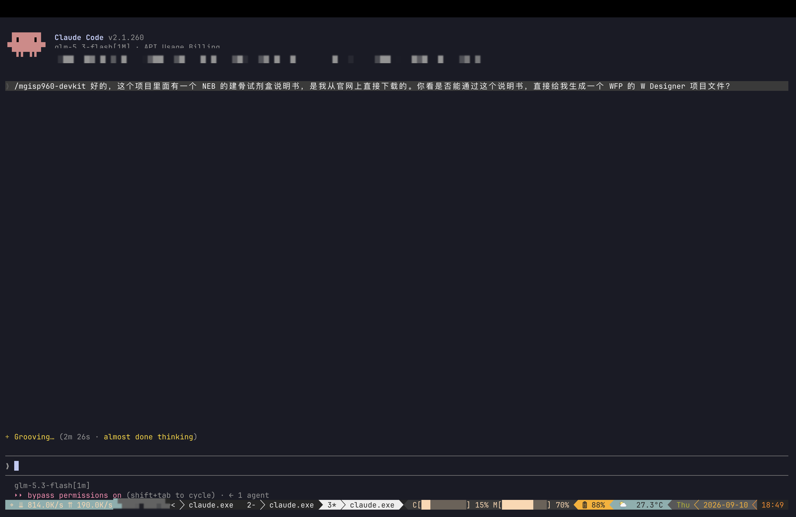
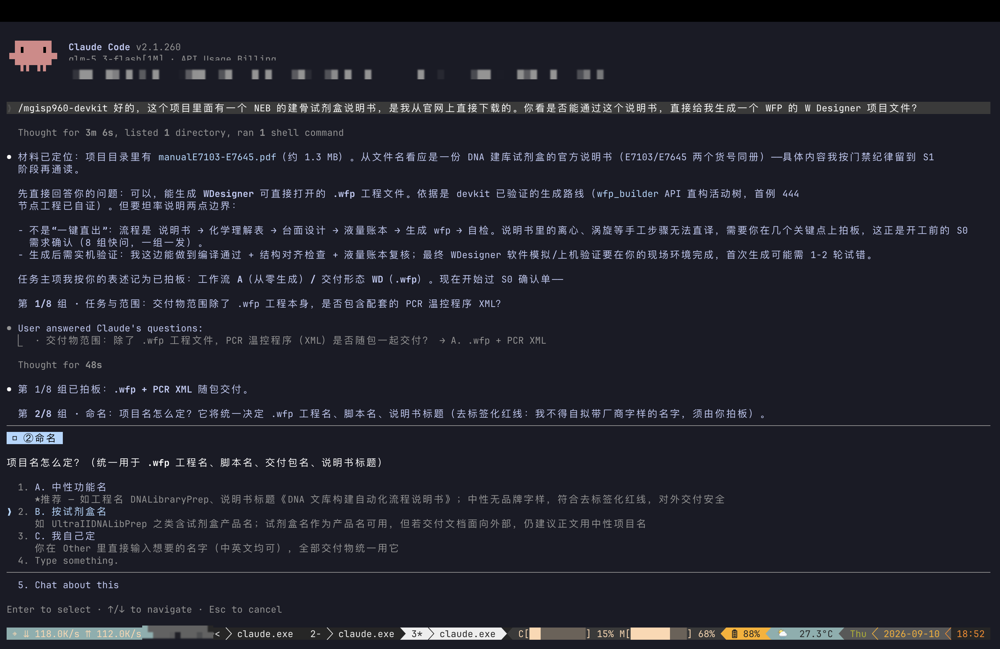
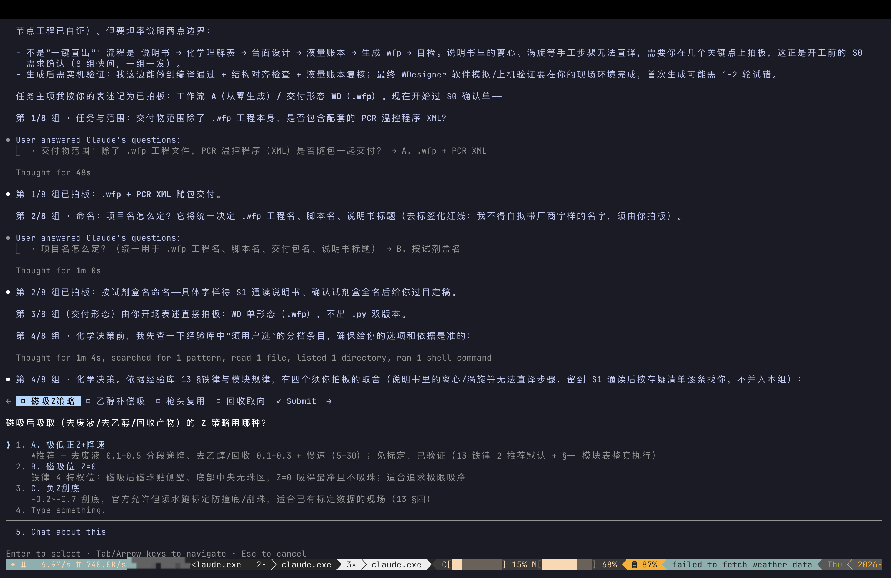
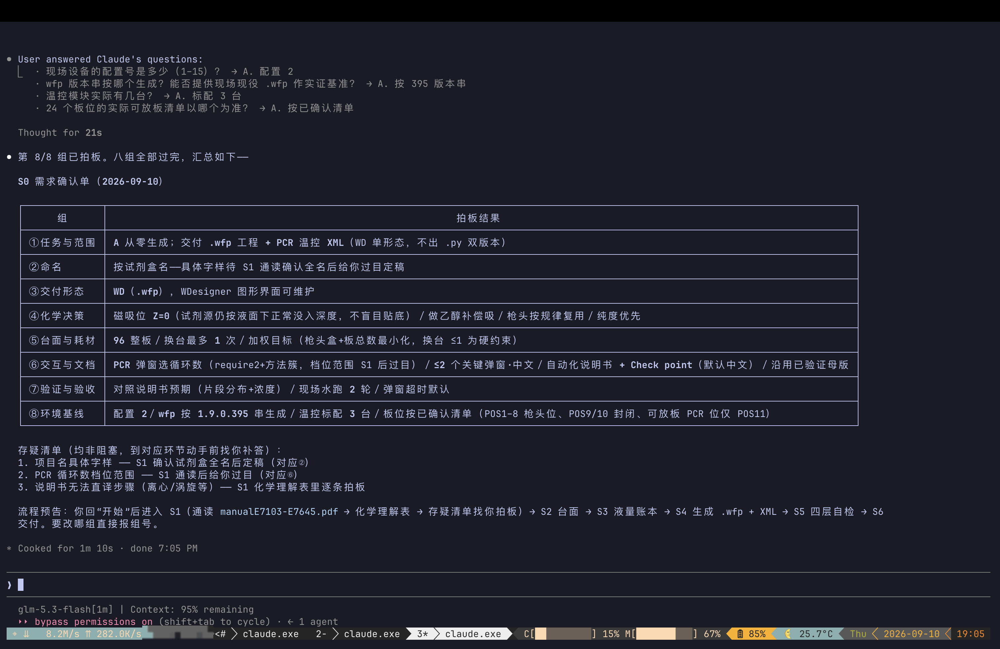
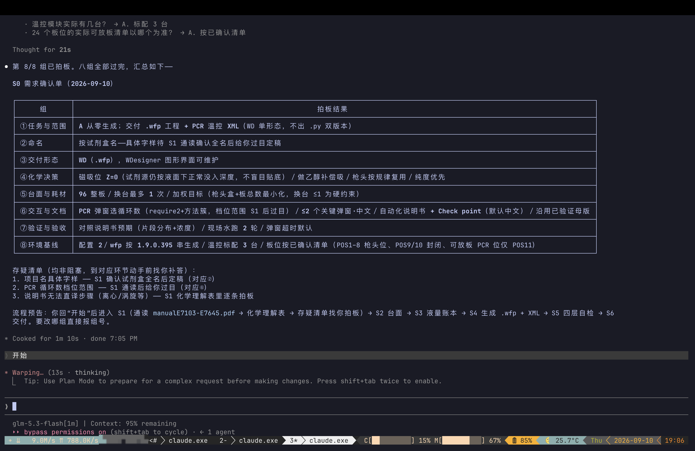
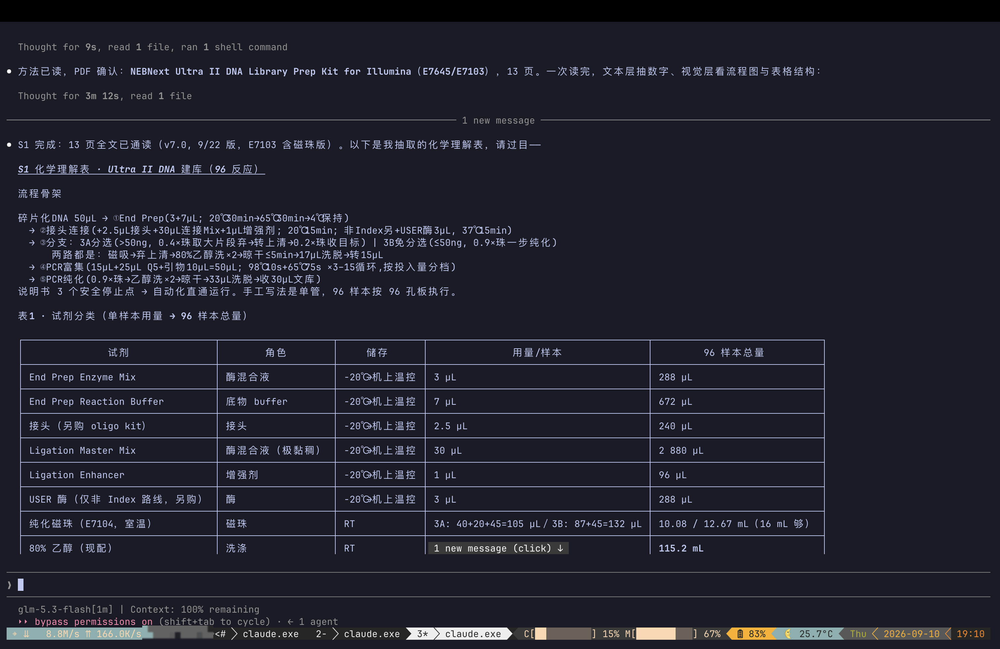
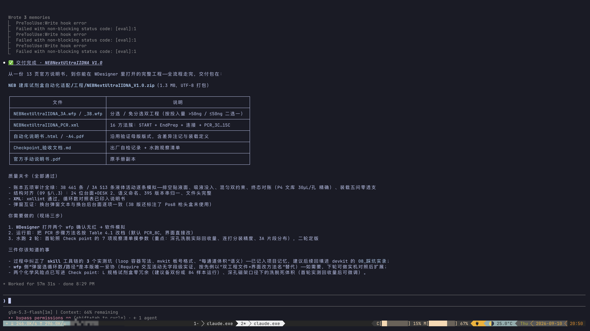
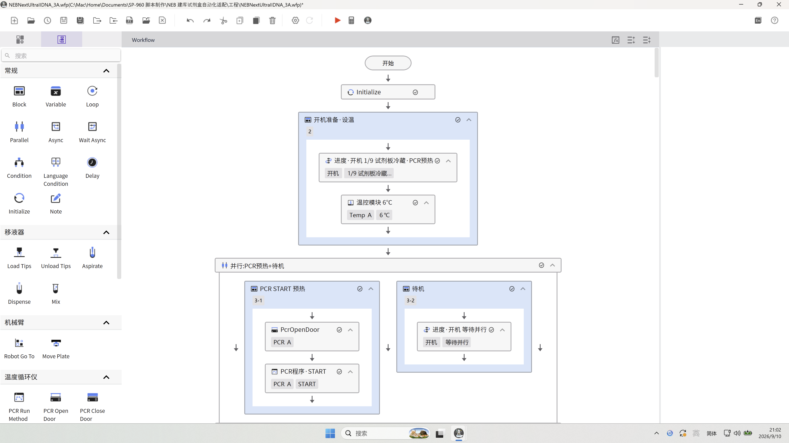
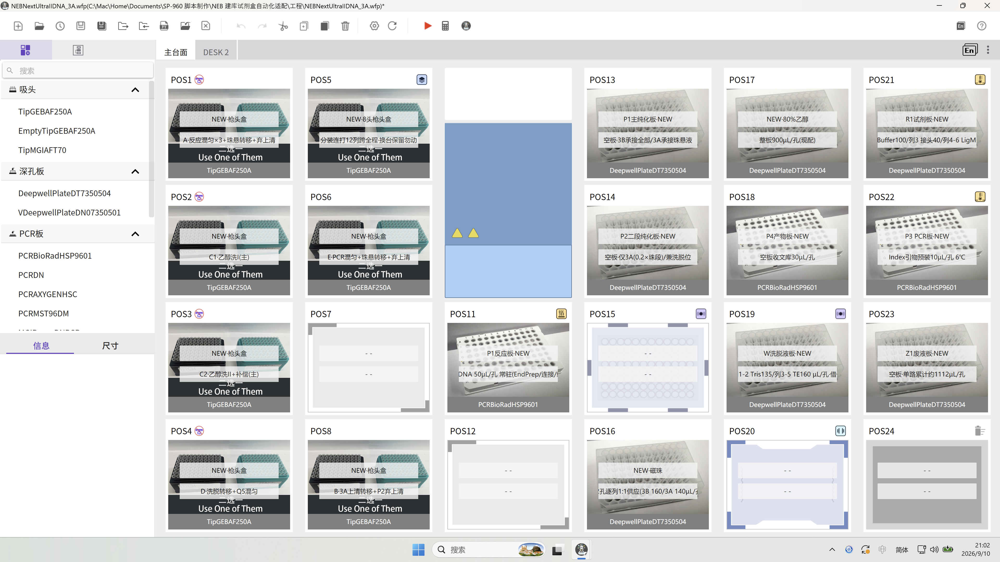

# Worked Example: A Vendor Website Manual → A Complete WDesigner Project

> The input was a library-prep kit manual PDF downloaded from a vendor website
> (13 pages, v7.0) — nothing custom or confidential, which is why the whole run
> can be published. From a one-line trigger to the delivery package, everything
> happened in a single session (about 57 minutes of wall-clock time). The human
> only answered 8 groups of multiple-choice questions and made a few chemistry
> calls. This page is written as a tutorial, so you can replicate it.

## Before You Start: Choosing a Model and an Agent

**Use a multimodal model (one that can read images), preferably with a
million-token context window.** Two reasons: the workflow diagrams, loading
tables, and fine-print footnotes in a manual are inevitably lost by text-only
extraction, so they must be read visually; and the per-step liquid-ledger
details later in the run benefit from a long context. Recommendations as of
September 2026:

| Pick | Models | Context |
|---|---|---|
| Used in this case | GLM-5.3-Flash | million-token |
| Multimodal, strong open options | Kimi K3 (Moonshot), Qwen3.8 Max (Alibaba), DeepSeek V4 | ~1M |
| International alternatives | Gemini 3.5 Flash, GPT-5.6 Sol, Claude Opus 4.8 | ~1M |

For the Agent, anything that supports the **Agent Skills standard (SKILL.md)**
works. This case was triggered with `/mgisp960-devkit` in Claude Code; peers
include:

- **Claude Code** — native support (used in this case)
- **Codex** — native Agent Skills support
- **Gemini CLI** — officially supports the open format
- **OpenCode / Cline / Roo / Kilo** — open-source agents that read SKILL.md
- **WorkBuddy**

## Input and Output

| | |
|---|---|
| **Input** | A kit manual PDF from the vendor website (End Prep → adaptor ligation → bead cleanup → PCR enrichment → library, 96-reaction format) |
| **Output** | `NEBNextUltraIIDNA_V1.0.zip`: dual `.wfp` projects (size-selection / cleanup-only), a PCR thermal XML (16-method cluster), an automated manual (HTML + A4 PDF), and a Check point acceptance document |

Now the whole run, in order.

---

## Step 0 · One-Line Trigger

The session starts with a single instruction stating where the manual is and
what the deliverable should look like:

```
/mgisp960-devkit There is a NEB library-prep kit manual in this project folder,
downloaded from their website. Can you turn it into a WFP W Designer project file?
```



Note the line at the bottom — "Grooving… (2m 26s · almost done thinking)". The
skill is not writing code yet. By its gate discipline, it must first run the S0
requirement interview: 8 groups of questions, one group per message, and
nothing gets written until every group is settled. **Expect the same rhythm
when you replicate: answer first, build later.**

## Step 1 · Locate the Material, State the Boundaries (S0, groups 1–2)

About two minutes later, the first reply does three things.

**First, it locates the material**: it lists the directory and recognizes from
the filename `manualE7103-E7645.pdf` that this manual covers two catalog
numbers (~1.3 MB). By gate discipline it does **not** read it yet — reading and
understanding the chemistry belongs to S1; for now it only confirms the
material exists.

**Second, it answers the actual question**: yes, the output can be a `.wfp`
that WDesigner opens directly. But it is upfront about two boundaries: this is
not "one-click generation" (manual steps such as centrifugation and vortexing
cannot be translated directly and need human decisions), and the result must be
validated on a real machine (locally it can guarantee a clean parse, structure
alignment, and the liquid-ledger audit; simulation and on-deck runs happen on
site).

**Third, it asks group 1/8** (should the PCR thermal XML ship with the
project?). The user picks A (.wfp + XML). Group 2/8 asks for the project name —
the skill is forbidden from inventing a brand-bearing name, so the user must
decide; three options with trade-offs, and the user picks B (name it after the
kit):



## Step 2 · Chemistry Decisions: Four Real Questions (S0, group 4)

Before asking, the skill checks its experience base for the items explicitly
marked "user must choose", so every option comes with an accurate
recommendation. This group matters most — each answer changes the generated
parameters:

1. **Aspiration Z strategy after magnetic capture** — determines recovery
   versus bead carry-over risk. Option A: very low positive Z + slow speed
   (★recommended, calibration-free, verified); B: Z=0 at magnet positions
   (beads collect on the side wall, the well center is bead-free — cleanest
   aspiration); C: negative Z scraping (officially allowed, but requires
   water-run calibration to avoid crashing);
2. **Ethanol compensation aspiration** — whether to explicitly top-up-aspirate
   residual ethanol between the two washes (residual ethanol inhibits
   downstream enzymes);
3. **Tip reuse** — consumable savings versus cross-contamination risk;
4. **Recovery orientation** — purity first or yield first.



The user leans aggressive here: Z strategy B (Z=0 at magnet positions, cleanest
aspiration), plus compensation aspiration ON, scenario-based tip reuse ON, and
purity first. All of these end up in the generated parameters.

## Step 3 · S0 Wrap-Up: The Eight-Group Summary

The four groups in between — deck & consumables (96-well full plate, at most 1
deck swap), interaction & documents (manual wanted? master template?),
validation & acceptance (how many water runs, acceptance criteria), and
environment baseline (device configuration number, software version string,
real deck layout) — are omitted here. What matters is the summary table after
group 8/8. This table is the project's contract:



Two things worth noticing: the **open-questions list** at the end — items that
cannot be answered yet (exact project name, PCR cycle range) are marked
non-blocking and deferred to the right stage instead of stalling the run; and
the pipeline preview (S1 read the manual → S2 deck → S3 liquid ledger → S4
generate → S5 self-check → S6 deliver).

The user replies with one word: "开始" (start):



## Step 4 · Reading the Manual into Three Tables (S1)

The skill reads all 13 pages under the two-channel discipline: **every number
comes from the text layer** (volumes, temperatures, times, cycle counts — zero
transcription errors), **diagrams and table structures come from the visual
layer**. This is why the multimodal-model advice at the top matters.

The output is a chemistry understanding sheet. In the screenshot below, the
workflow skeleton is compressed into a single chain (each step carries volumes
and temperatures — e.g. End Prep is 3+7 µL, 20 °C 30 min → 65 °C 30 min), and
the first table is the reagent classification sheet whose right-most column
totals reagents for 96 samples (End Prep enzyme 288 µL, ligation mix
2 880 µL, …). That column later becomes the loading definition:



More important is the open-questions list, which surfaces branches easy to
miss: >50 ng / ≤50 ng inputs map to **two different cleanup routes**
(size selection adds beads twice with two magnetic captures; cleanup-only is a
single 0.9× addition); who performs the adaptor dilution; and the chain
constraint from the magnet format on plate types. Each one gets a user
decision. The final calls: both routes behind a dialog, adaptor dilution done
by the user offline, and **reactions in PCR plates with purification moved to
deep-well plates** (the on-site magnet only accepts deep-well plates, so
reaction plates cannot sit on it — this hardware fact reshaped the whole deck
design).

## Step 5 · Deck and Liquid Ledger (S2/S3)

No screenshots in this stretch, but it decides delivery quality.

The deck design first collides with on-site hardware: the magnet rack only
accepts deep-well plates, so reaction plates cannot sit on it directly. The
solution: reactions and mixing stay in PCR plates (better precision at small
volumes), then the whole plate transfers into a deep-well plate for magnetic
cleanup — and the transfer loss of every such step is quantified into the
delivery documents.

Then the liquid ledger: every liquid operation is simulated one by one,
accumulating per-well volume and liquid level, followed by five audits
(empty-dispense level anchoring, aspiration immersion depth, mixing
dual-constraints, reaction end-state reconciliation, and the five loading
questions). Across both routes that is roughly 950 activity records; after one
correction round all audits pass green, with the final library at exactly
30 µL per well. **You do not need to understand this layer to replicate — if
the ledger is not green, the skill iterates by itself and only comes back to
you when a chemistry judgment is needed.**

## Step 6 · Generate and Deliver (S4/S6)

`wfp_builder` generates the activity tree directly (every activity carries a
Chinese semantic name), together with the PCR method-cluster XML (16 methods:
pre-heat, End Prep, ligation, and a PCR cluster covering 3–15 cycles), and the
manual reuses the master layout of a previously validated project — layout
recycled, content fully replaced. The final session summary looks like this:



Three blocks worth reading: the **file table** (dual-route wfp, 16-method XML,
manual, Check point); the **quality gates** (five ledger audits all green — 461
records for 3B / 513 for 3A, final library exactly 30 µL per well; structure
alignment; XML validation; dialog-versus-deck cross-check); and the **"three
on-site steps"** — open in WDesigner → software simulation → two water runs
(first run tunes parameters against the 7-point checklist in the Check point
document, second run accepts against the manual's expectations).

## Step 7 · On-Site: Seeing It in WDesigner

That same evening the delivery package was copied to a Windows machine on site
and `_3A.wfp` was opened in WDesigner — which officially passes the "Step 0:
open confirmation" line in the Check point document: the generated file opens
in the real software, with deck and workflow rendering clean.

Start with the **main deck**. All 24 positions render as defined, and the most
valuable part is each position's comment — these are not decoration, they are
loading instructions for the operator: POS5 (8-channel tips) reads "12-column
continuous dispensing for the whole run · do not touch at deck swap", POS11
(reaction plate) reads "DNA 50 µL/well, resident", POS21 (reagent plate) lists
per-column loads (Buffer 100 / col 3 adaptor 40 / col 4-6 lig mix …), POS23
(waste) reads "empty plate · single stream ≈1 112 µL/well". Magnet positions
POS15/19 stay empty, the shaker POS20 is reserved for elution mixing, and
bead-carrying plates never park on magnet positions — all deck discipline is
written into the comments. The DESK 2 tab is also visible: the post-swap deck
definition ships inside the same file:



Now the **Workflow canvas**. The flow runs from "Start → Initialize" downward,
one Block per chemistry stage, each named in plain language — "Startup ·
temperature" (progress "1/9" + temp module 6 °C) and "Parallel: PCR pre-heat +
standby" (PCR START pre-heating and standby running as two branches). An
engineer on site can read the flow without opening any document; the left
panel (Block / Loop / pipettor / robot arm / thermal cycler) shows the building
blocks the whole project is assembled from:



At this point the loop "one manual → one openable, readable project" is closed.
Software simulation and the two water runs (parameter tuning, then sign-off)
continue per the Check point checklist; once the data comes back, parameters
are filled in and the project is finalized.

## Replication Checklist

1. **Prepare**: the manual PDF (a public one is fine) plus three hardware facts
   (device configuration number, magnet-rack plate format, software version) —
   S0 will ask for all of them;
2. **Model**: multimodal + long context (e.g. GLM-5.3-Flash, Kimi K3,
   Qwen3.8 Max, DeepSeek V4; international alternatives: Gemini 3.5 Flash /
   GPT-5.6 Sol / Claude Opus 4.8);
3. **Agent**: Claude Code, Codex, Gemini CLI, OpenCode — any coding agent that
   supports the Agent Skills standard (SKILL.md);
4. **Trigger**: `/mgisp960-devkit There is a library-prep manual in this
   folder — build me a WDesigner project`;
5. **Cooperate**: answer the 8 interview groups (each has a recommended option,
   "go with recommended" is a valid answer), and make the calls on chemistry
   branches and manual steps that cannot be automated directly;
6. **Close out**: take the delivery package through on-site validation per the
   Check point document — open in WDesigner → software simulation → two water
   runs (tune, then sign off).
